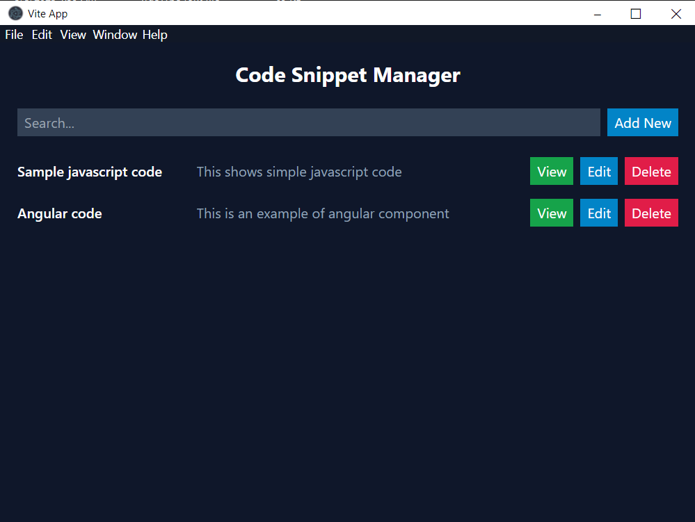

# Code snippet manager application

This very simple application, utilizes [Vite](https://github.com/vitejs/vite), [Tailwind](https://tailwindcss.com/), [React](https://reactjs.org/), [Typescript](https://www.typescriptlang.org/) and [Electron](https://electronjs.org/).

## Installation

`yarn` or `npm install`

## Development

`yarn dev` or `npm run dev`

## Build

`yarn build` or `npm run build`

## Publish

`yarn dist` or `npm run dist`
